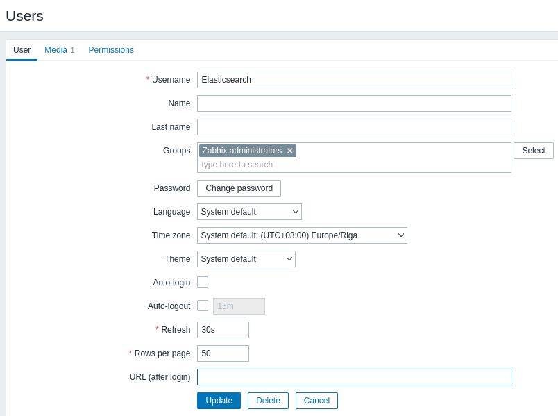

# Zabbix Elasticsearch Lab

This repo will provide a basic setup for testing Zabbix 6.4.latest in combination with Elasticsearch 8.13.0. You need docker-compose for this lab, the setup of docker-compose is however beyond the scope of this lab.

Disclaimer: This is a very basic lab to test the Zabbix Elasticsearch Mediatype. This lab is not for production purposes, it uses default configurations and lacks security. Local storage is not configured in the docker-compose file, so after stopping the lab, all configuration will be lost unless you apply changes to the docker-compose file.

## Start docker-compose
You can start the lab by executing the command ```docker-compose up``` from whithin this direcory. 

## Configure Elasticsearch
After the startup of the docker containers you will be able to browse to Kibana http://localhost:5601

As you can see, no password is required, this means security is not enabled in Elasticsearch and a creation of an API key for the Zabbix Mediatype is not needed in this situation. 

1. Create an Index template in Elasticsearch to ensure your Zabbix data will be correctly indexed:
   - In Kibana, go to `Management` -> `Dev Tools` and paste the content from the file [elasticsearch_index.txt](./elasticsearch_index.txt). Then execute the code


2. Import the Mediatype:
   - Browse to the Zabbix webinterface en login with default credentials Admin/zabbix
   - In Zabbix go to `Alerts` -> `Media types` and click Import, browse to the xml file and click Import
   - Open the Mediatype and make sure these parameters match the values:
     - elastic_url: http://elasticsearch:9200/
     - elastic_index: zabbix_events
     - zabbix_url: http://localhost


3. Create a new user for Elasticsearch:
   - Browse to `Users` -> `Users` and click `Create user`
   - Enter Username `Elasticsearch`
   - Enter a random password
   - Click the `Media` tab and `Add` to add a mediatype
   - Enter `Elastic` in `Send to` and click `Add`
   - Click the `Permissions` tab and add Role `Super Admin role`
   - Click `Add` to add the user




>Note: A separate users is created to make sure updates of problems will also be send to Elasticsearch. In this lab, Role Supper Admin and User group Zabbix Administrators is used for this user, best practice is to create a separate role and User group with only read rights to hostgroups needed for this Mediatype.

4. Create the trigger actions:
   - Browse to `Alerts` -> `Actions` -> `Trigger actions` and click `Create action`
   - Add name `Elasticsearch`
   - Under Conditions click `Add`
   - Select type `Trigger severity`, Operator `is greater then or equals` and Severity `Not classified`
   - Click the `Operations` tab and under `Operations` click `Add`
   - In the `Send to users` field, fill in the `Elasticsearch` user and click `Add`
   - Click `Add` next to Recovery operations and select `Notiry all involved` and click `Add`
   - Click `Add` next to Recovery operations and select `Notiry all involved` and click `Add`
   - Leave all other fields default and click `Add` to add the Elasticsearch action


5. Test your Mediatype
   - Browse to `Alerts` -> `Media types` and next to the Elasticsearch Mediatype click `Test`
   - Click `Test` and the Mediatype test should be succesfull, in the Response you will see a string which is the Document ID created in Elasticsearch


6. Show your trigger actions in Elasticsearch
   - Browse to Kibana at http://localhost:5601
   - You will be presented a "Welcome to Elastic" screen
   - You don't need to add integrations now, click `Explore my own`
   - Click the top left menu Button and scroll down and click `Stack Management`
   - Under Kibana click `Data Views` and `Create data view`
   - Fill in Name `Zabbix Events`, Index pattern `zabbix_events*`.
   - Make sure Timestamp field matches `@timestamp` and click `Save data view to Kibana`
   - You can now browse to `Analytics` -> `Discover` to see your Trigger actions generated in Elasticsearch
   - By default this screen shows documents created in the last 15 minutes, if you don't see any data, change the scope of your view in the drop down top left
   - You can now see your Trigger actions send from Zabbix. The document generated with the test is almost empty. 


You can now analyze your triggers in Elasticsearch. In the graph you will see all trigger actions present in Elastic over the selected time period. At the left collum, you can hover over all fields. If you click a field, you will be able to see the top values and with the button `Visualize` you will be able to create graphs, which you can also place on a dashboard.

